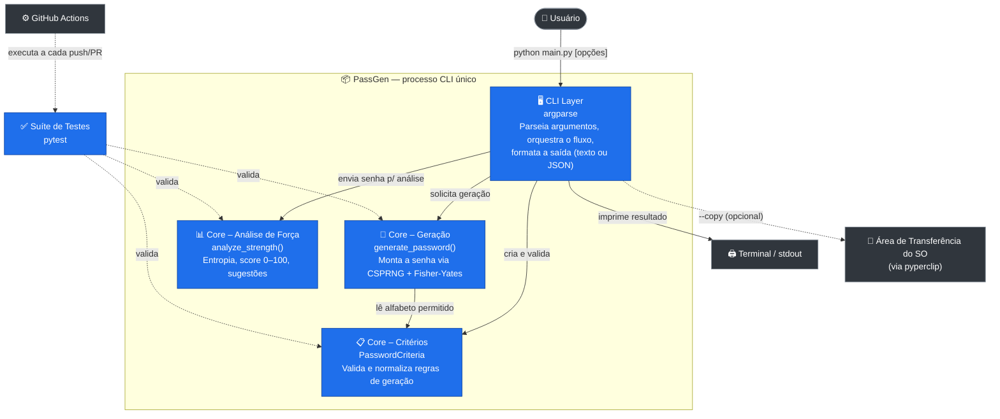
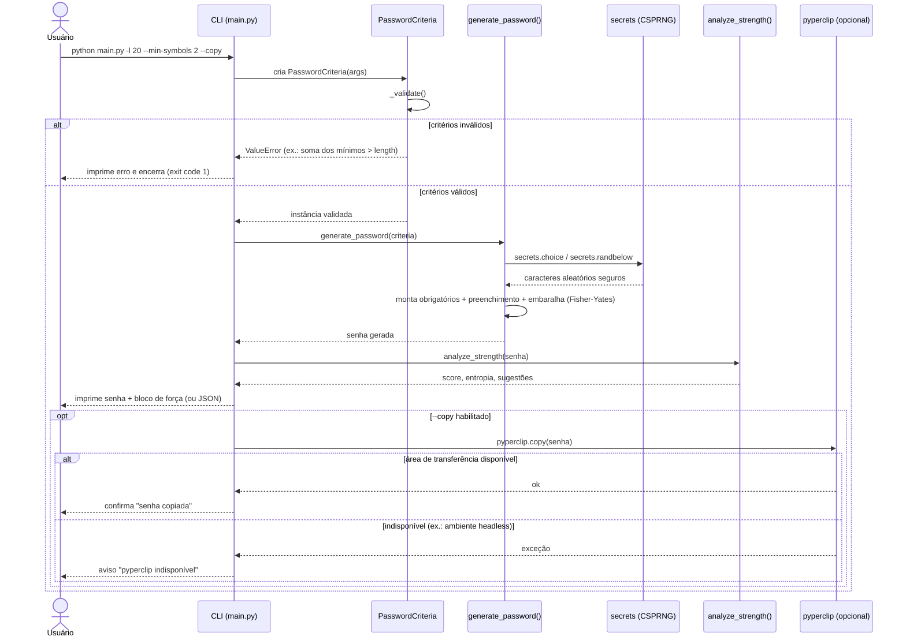

# 🔐 PassGen — Gerador de Senhas Seguras

> MVP de uma ferramenta CLI em Python para geração de senhas aleatórias, seguras e personalizáveis.

---

## Problema e Solução

A criação de senhas seguras é uma necessidade constante para proteger contas e dados, mas muitos usuários têm dificuldade em gerar senhas fortes e únicas.

O **PassGen** resolve isso com uma interface de linha de comando simples e direta, permitindo ao usuário configurar tamanho, tipos de caracteres e garantindo robustez por meio de validações e testes automatizados.

---

## Arquitetura (visão rápida)

O projeto é organizado em três módulos principais:

- **CLI**: Interface de linha de comando construída em Python (`argparse`).
- **Core**: Lógica de geração e validação de senhas, além da análise de força.
- **Testes**: Cobertura automatizada com pytest.

> Para a visão detalhada de arquitetura (escopo, limites, integrações e diagramas), veja a seção [🧭 Discovery de Arquitetura](#-discovery-de-arquitetura-diagrams-as-code) abaixo.

---

## Requisitos

- Python 3.8+
- Dependências: ver `requirements.txt`

---

## Instalação

```
pip install -r requirements.txt
```

---

## Uso Básico

```
python main.py --length 12 --uppercase --lowercase --numbers --specials
```

**Parâmetros disponíveis:**

| Parâmetro     | Descrição                         |
| ------------- | ---------------------------------- |
| `--length`    | Tamanho da senha (máx. 1.024)      |
| `--uppercase` | Incluir letras maiúsculas          |
| `--lowercase` | Incluir letras minúsculas          |
| `--numbers`   | Incluir números                    |
| `--specials`  | Incluir caracteres especiais       |

A senha gerada pode ser copiada automaticamente para a área de transferência com `--copy` (requer `pyperclip`).

---

## Exemplos

```
# Senha com números e minúsculas, tamanho 20
python main.py --length 20 --no-uppercase --lowercase --numbers --no-specials

# Apenas caracteres especiais, tamanho 8
python main.py --length 8 --no-uppercase --no-lowercase --no-numbers --specials

# Senha longa com todos os tipos
python main.py --length 1000 --uppercase --lowercase --numbers --specials

# Exibir ajuda
python main.py --help
```

---

## Testes

```
# Rodar os testes
python -m pytest tests/

# Rodar com relatório de cobertura
python -m pytest --cov=. --cov-report=html:docs/cov_html tests/
```

O relatório em HTML estará disponível em `docs/cov_html/index.html` após a execução.
> **Nota:** recomenda-se adicionar `docs/cov_html/` ao `.gitignore`.

---

## Roadmap

- [x] Geração de senhas configuráveis (MVP)
- [ ] Validação de senhas contra base de vazamentos (Have I Been Pwned)
- [ ] Interface web

---

## Storytelling: Como a IA Acelerou Este Projeto

Este projeto foi desenvolvido com a ajuda de ferramentas de IA como Claude (Anthropic), que permitiram:

- ✨ Geração rápida da estrutura base do CLI em Python
- ✨ Automação de testes unitários com pytest
- ✨ Validação robusta de critérios com mensagens descritivas
- ✨ Sugestões de boas práticas e refatoração

## Limitações Identificadas

- ⚠️ A IA gerou lógica de entropia sem considerar todos os padrões fracos
- ⚠️ Faltou validação de entrada em alguns casos extremos
- ⚠️ O teste `test_repeated_chars_penalized` precisou de ajuste manual
- ⚠️ Segurança: variáveis sensíveis devem ser mantidas no `.env`

---

## 🧭 Discovery de Arquitetura (Diagrams as Code)

Esta seção documenta a fase de discovery do PassGen conduzida como exercício da Unidade III (diagrams as code). O objetivo é registrar, em linguagem natural e em diagramas versionáveis (Mermaid), como o sistema funciona hoje — servindo como contexto reutilizável para futuras evoluções ou para agentes de desenvolvimento com IA.

### Escopo

O PassGen é um **utilitário de linha de comando standalone**, executado localmente em um único processo Python (`main.py`). Ele não é um serviço de rede, não possui backend/frontend separados, não persiste dados em banco e não se comunica com nenhuma API externa. Toda a execução acontece dentro do processo iniciado pelo usuário no terminal, do início (parse dos argumentos) ao fim (impressão da senha e, opcionalmente, cópia para a área de transferência).

### Nível de visão

Dado o tamanho do sistema (um único processo, sem múltiplos serviços), a visão mais útil é o **nível 2 do C4 (Containers)**, tratando cada responsabilidade lógica (CLI, geração, análise de força) como um "container" dentro do mesmo processo — mesmo estando fisicamente no mesmo arquivo `main.py`. O nível 1 (Contexto) seria trivial demais (apenas Usuário ↔ PassGen ↔ SO), por isso ele foi resumido dentro do próprio diagrama de containers.

### Limites e responsabilidades

| Componente | Responsabilidade | Não faz |
|---|---|---|
| **CLI Layer** (`build_parser`, `main`) | Parsear argumentos, orquestrar o fluxo, formatar saída (texto colorido ou JSON), tratar erros de entrada | Não gera nem valida senhas diretamente |
| **Core — Critérios** (`PasswordCriteria`) | Validar e normalizar as regras de geração (tamanho, conjuntos de caracteres, mínimos, exclusões) | Não gera a senha em si |
| **Core — Geração** (`generate_password`) | Montar a senha usando o módulo `secrets` (CSPRNG) e embaralhamento Fisher-Yates | Não decide critérios nem imprime nada |
| **Core — Força** (`analyze_strength`) | Calcular entropia, score (0–100) e sugestões heurísticas para *qualquer* senha informada | Não impede a geração de senhas fracas, apenas informa |
| **Testes** (`tests/`, `conftest.py`) | Validar contratos dos módulos acima via pytest | Não roda em produção |

### Integrações

- **Biblioteca padrão do Python**: `secrets` (gerador criptográfico), `string`, `re`, `math`, `json`, `argparse` — não há dependências externas para a lógica central.
- **`pyperclip`** (opcional, listada em `requirements.txt`): integra com a área de transferência do sistema operacional quando o usuário passa `--copy`. A falha dessa integração é tratada de forma resiliente (aviso, sem interromper o programa).
- **GitHub Actions** (`.github/workflows`): pipeline de CI que executa a suíte de testes a cada push/PR — não faz parte do runtime do usuário final, mas integra o ciclo de vida do repositório.

### Restrições e lacunas identificadas

- **Inconsistência de documentação encontrada durante o discovery**: a tabela de uso original do README dizia "tamanho máx. 1.000.000", mas o código define `MAX_LENGTH = 1024`. Corrigido nesta versão do README (ver seção "Decisões e ajustes" abaixo).
- Sem persistência: nenhuma senha gerada é salva em disco pelo próprio programa — a única saída duradoura possível é o que o usuário redireciona manualmente (ex.: `> arquivo.txt`) ou copia via `--copy`.
- Sem verificação contra vazamentos (Have I Been Pwned) — está no roadmap, ainda não implementado.
- Sem interface web — está no roadmap, ainda não implementado.
- Menção a variáveis sensíveis em `.env` no README, mas não há uso de `python-dotenv` nem leitura de variáveis de ambiente em `main.py` — trata-se de uma recomendação de higiene para uso futuro (ex.: se a ferramenta vier a se integrar a serviços externos), não de uma funcionalidade atual.
- `--copy` depende de um pacote opcional (`pyperclip`) e de acesso à área de transferência do SO/sessão gráfica; em ambientes headless (ex.: servidores, containers, CI) essa integração pode falhar silenciosamente (o código já trata isso com um aviso).

### Diagrama Estrutural — Containers (inspirado em C4)

> **Nota técnica:** a primeira versão deste diagrama usava a sintaxe `C4Container` do Mermaid. O renderer de Mermaid usado pelo GitHub trata esse tipo de diagrama como experimental e produz um layout com setas e rótulos sobrepostos, difícil de ler. Por isso, o diagrama abaixo foi reescrito como um `flowchart` (grafo) padrão — sintaxe mais estável e com melhor suporte de layout — mantendo o mesmo nível de detalhe (containers, responsabilidades e relações) inspirado em C4.



### Diagrama Comportamental — Sequência: "Gerar senha segura via CLI"

Jornada crítica escolhida: usuário pede uma senha com critérios customizados e opta por copiá-la para a área de transferência, incluindo o caminho de erro por critérios inválidos.



### Decisões e ajustes feitos sobre o que a IA gerou

Ao usar GenAI para produzir uma primeira versão dos diagramas a partir da leitura do código, os seguintes ajustes manuais foram aplicados:

1. **Correção de dado factual**: o rascunho inicial repetia o limite de "1.000.000" de caracteres do texto antigo do README; ao cruzar com o código-fonte (`MAX_LENGTH = 1024`), o valor foi corrigido em todo o documento. Isso reforça o valor de descrever o sistema a partir do código real, não apenas da documentação existente.
2. **Nível de C4 escolhido manualmente**: o modelo sugeriu inicialmente um diagrama de Contexto (nível 1) separado; como o sistema é pequeno e de processo único, optei por consolidar tudo em um único diagrama de Containers (nível 2), citando o usuário e os sistemas externos ali mesmo, para evitar redundância.
3. **Separação de "Critérios" e "Geração" como containers distintos**: o rascunho inicial tratava `PasswordCriteria` e `generate_password` como um único bloco "Core". Separei porque são responsabilidades diferentes (validação de regras vs. geração criptográfica), o que fica mais claro para quem for usar este diagrama como contexto de implementação no futuro.
4. **GitHub Actions incluído como sistema externo**: o modelo não havia considerado o pipeline de CI (`.github/workflows`) como parte da arquitetura documentável; adicionei porque ele integra o ciclo de vida do repositório, mesmo não fazendo parte do runtime do usuário final.
5. **Diagrama de sequência restrito a uma única jornada crítica**: o modelo sugeriu inicialmente cobrir todos os caminhos de saída (JSON, quiet, count > 1, etc.) em um só diagrama de sequência, o que ficou poluído. Optei por manter apenas a jornada "gerar senha com critérios customizados + cópia para clipboard", incluindo o ramo de erro de validação, por ser a jornada mais representativa do sistema ponta a ponta.
6. **`docs/` e `Makefile` não modelados como containers**: são artefatos de build/relatório (cobertura de testes) e não participam do fluxo de execução do usuário, então foram citados apenas em texto, não nos diagramas.

---

## Sobre este repositório

Este repositório é mantido como uma **base de documentação viva**: a descrição em linguagem natural e os diagramas Mermaid acima devem ser atualizados sempre que a arquitetura do PassGen mudar, servindo de contexto para futuras evoluções — inclusive para agentes de desenvolvimento com IA que venham a implementar novas funcionalidades com aderência ao que está documentado aqui.
